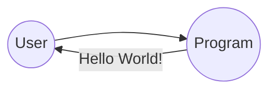

# Hello World!

_"Hello World"_[^helloworldwiki] has become the beacon for all developers since Carnigan & Richie. 

In the same way one would expect a baby to say its first words, a developer will long for having a 
new service to provide the first response, usually in this widely used expresion. 

> _Hello World_

[^helloworldwiki]: https://en.wikipedia.org/wiki/%22Hello,_World!%22_program
