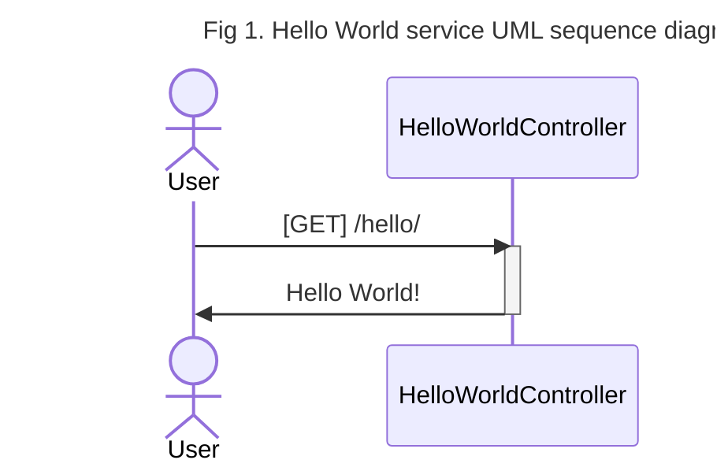

# Hello World: Simple REST Microservice 

In this opportunity we're building a small service named _HelloWorld_ which provides users a unique way to interact which returns the desired _"Hello World!"_ message.  

As this is a REST microservice, the HelloWorld service access is given thru an URL path, which in this case is `/hello/`. Any access to this URL will result with the plain `Hello World!` text string. 




This predefined interaction determines a contract between the user and the service (one in which any `/hello/` invocation results in `Hello World!` as answer)

This contract is named API[^api_note] and there are several forms to represent it either graphically (Fig 1) using UML[^UMLwiki] or programatic (using several formats). The programatic representation used here is the one defined by OpenAPI[^openapi] that establishes the following definition for our service: 

[^UMLwiki]: [https://en.wikipedia.org/wiki/Unified_Modeling_Language](https://en.wikipedia.org/wiki/Unified_Modeling_Language)
[^api_note]: [https://en.wikipedia.org/wiki/API](https://en.wikipedia.org/wiki/API)
[^openapi]: [https://www.openapis.org/](https://www.openapis.org/)

```yaml
#Snipped
paths:
  /hello/:
    get:
      tags:
      - hola-mundo-rest-simple-controller
      summary: Hello World
      operationId: hola
      responses:
        "200":
          description: Saludo Hello World
          content:
            text/plain:
              schema:
                type: string
```
