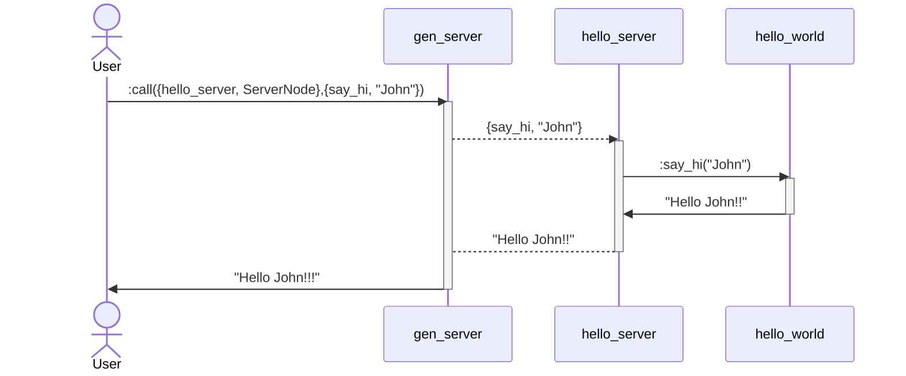

Hello World
=====

Simple OTP Server that handles a `{ say_hi, Param }` message  
and sends back a  `"Hello {Param}!!!"` message.

OTP Service
---





Run
---

#### 1. Start the service & the client and confirm the connectivity 
<table>
<tr>
<th>hello_server</th>
<th>User</th>
</tr>
<tr>
<td id="shell1">

```shell
❯ _build/default/rel/hello_world/bin/hello_world foreground
Exec: [***]
Root: [***]
_build/default/rel/hello_world
Running hello_server on 'hello@Fernandos-MBP.fibertel.com.ar' :{ok,<0.282.0>}


```

</td>
<td id="shell2">

```shell

❯ erl -name client_node -setcookie hello
Erlang/OTP 26 [****]

Eshell V14.0.2 (press Ctrl+G to abort, type help(). for help)
(client_node@Fernandos-MBP.fibertel.com.ar)1> ServerNode='hello@Fernandos-MBP.fibertel.com.ar'.
'hello@Fernandos-MBP.fibertel.com.ar'

(client_node@Fernandos-MBP.fibertel.com.ar)2> net_adm:ping(ServerNode).
pong

```
</td>
</tr>
</table>


#### 2. Called `say_hi` 


<table>
<tr>
<th>hello_server</th>
<th>User</th>
</tr>
<tr>
<td id="shell1">

```shell
❯ _build/default/rel/hello_world/bin/hello_world foreground
Exec: [***]
Root: [***]
_build/default/rel/hello_world
Running hello_server on 'hello@Fernandos-MBP.fibertel.com.ar' :{ok,<0.282.0>}


hello_server message: Hello John!!!


```

</td>
<td id="shell2">

```shell

❯ erl -name client_node -setcookie hello
Erlang/OTP 26 [****]

Eshell V14.0.2 (press Ctrl+G to abort, type help(). for help)
(client_node@Fernandos-MBP.fibertel.com.ar)1> ServerNode='hello@Fernandos-MBP.fibertel.com.ar'.
'hello@Fernandos-MBP.fibertel.com.ar'

(client_node@Fernandos-MBP.fibertel.com.ar)2> net_adm:ping(ServerNode).
pong

(client_node@Fernandos-MBP.fibertel.com.ar)3> Pid={hello_server, ServerNode}.
{hello_server,'hello@Fernandos-MBP.fibertel.com.ar'}

(client_node@Fernandos-MBP.fibertel.com.ar)4> gen_server:call( Pid,{say_hi, "John"}).
"Hello John!!!"


```
</td>
</tr>
</table>
