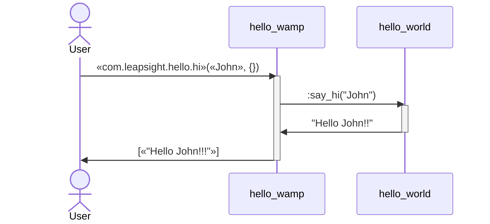

Hello World WAMP microservice
=====

Simple WAMP Microservice that registers a RPC call `«com.leapsight.hello.hi»` 
URI which handles a `«{Param}»` message sending back a `[«"Hello {Param}!!!"»]` message.



## Run WAMP Microservice

#### 1. Start the service & the client and confirm the connectivity
```shell
❯ _build/default/rel/hello_world/bin/hello_world foreground
Exec: [***]
Root: [***]
_build/default/rel/hello_world
00:29:58.001 [info] registering procedure uri=<<"com.leapsight.hello.hi">> ...
00:29:58.006 [info] registered reg_id=4466978118432401.
Running hello_server on 'hello@Fernandos-MBP.fibertel.com.ar' :{ok,<0.480.0>}
```


#### 2. Called `say_hi`


<table>
<tr>
<th>hello_server</th>
<th>User</th>
</tr>
<tr>
<td id="shell1">

```shell
❯ _build/default/rel/hello_world/bin/hello_world foreground
Exec: [***]
Root: [***]
_build/default/rel/hello_world
00:29:58.001 [info] registering procedure uri=<<"com.leapsight.hello.hi">> ...
00:29:58.006 [info] registered reg_id=4466978118432401.
Running hello_server on 'hello@Fernandos-MBP.fibertel.com.ar' :{ok,<0.480.0>}


hello_wamp message: Hello John!!!


```

</td>
<td id="shell2">

```shell


❯ wick \
    --realm="com.leapsight.bondy" \
    --url=ws://localhost:18080/ws \
    call \
    com.leapsight.hello.hi \
    John
[
    "Hello John!!!"
]
```
</td>
</tr>
</table>


